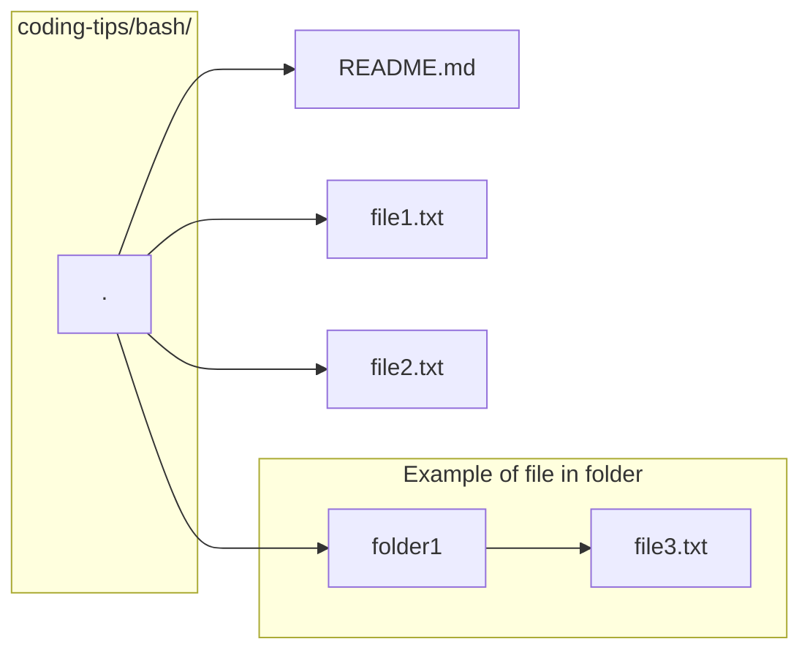

# `bash` basics

Assume the following file structure.

```bash
. # coding-tips/bash/
├── file1.txt
├── file2.txt
├── folder1
│   └── file3.txt
└── README.md
```

Or if this is easier to visualize:



## Navigation

- `~` refers to the home directory
- `.` refers to the current directory
- `..` refers to the parent directory

If we are currently in `coding-tips/bash/`, to get to `file3.txt`, there are two ways to talk about where `file3.txt` is:

- Relative pathing is the path **from your current directory**
  - `./folder1/file3.txt`
- Absolute pathing is the path from a **defined starting point**
  - `/~/coding-tips/bash/folder1/file3.txt`

```bash
# Move to home directory at /~/
cd

# Move into a directory called 'folder1'
cd folder1

# Move one directory UP from the current directory
cd ..
```

## Creating files and folders

```bash
# Create an empty file
# You can put any file extension
touch file1.txt

# You can create many files
touch file1.txt file2.txt file3.txt ...

# Create a directory (folder)
mkdir folder1

# You can also create many folders
mkdir folder1 folder2 folder3 ...
```

## Removing files and folders

```bash
# Remove a file
rm file1.txt

# Can't remove a folder in the same way
# Need to use recursive flag
# sudo if there are write/delete protected files
# BE CAREFUL BECAUSE YOU CANNOT GET THESE FILES BACK
[sudo] rm -r folder1
```

## Moving and Renaming

```bash
# To move a file or folder around
mv my_file ./folder1/

# To rename a file or folder
mv old_file_name new_file_name
```

---

## Commands

- `code [-r] <file or folder>` to open file or folder in VSCode in new window; `-r` to open in same window

## Generally Useful

- Tab for autocompletion

## Key Shortcuts

- `<Ctrl-c>` to cancel the current process or clear the current terminal line
- `<Ctrl-l>` to clear the screen

## Installing packages

```bash
# Will need higher privileges for installing a package with apt
sudo apt install <package name>
```

## Improved [`bash`](https://github.com/ohmybash/oh-my-bash)

- New themes and cleaner look
- Better autocompletion
- Plugins

```bash
bash -c "$(curl -fsSL https://raw.githubusercontent.com/ohmybash/oh-my-bash/master/tools/install.sh)"
```
