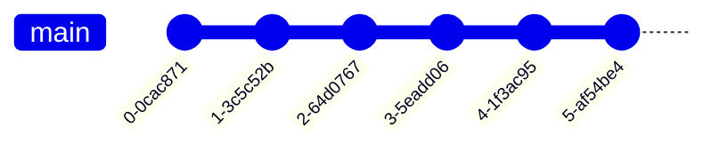

# git

## Introduction

`git` is known as a version control system or VCS.

As developers, we use `git` to track changes to our projects over time.

To highlight, you can:

- Mark important points in development
- Revert to previous stages in the codebase easily
- Visualize how the project changes over time

### Visualization

The greatest strength of `git` is that we can develop _incrementally_ by committing small changes over time. We can **checkout** any commit to browse the codebase at that moment in time, like a _snapshot_.

The place where we store our code is called `git` repository, or a repo for short.

#### Basic

Consider this basic git repo.



Here are the highlights:

- The `main` branch holds all of the code
- There are six nodes on the `main` branch; these are called **commits**
  - Commits are _snapshots_ of your repo at that moment in time
  - The files are _just as they were_ at the moment you committed
- The ID under each commit is a unique, generated commit identifier
  - For the curious, `git` calculates these IDs by [hashing](https://ericsink.com/vcbe/html/cryptographic_hashes.html#:~:text=Git%20uses%20hashes%20in%20two,computed%20when%20it%20was%20stored.) many different factors to ensure [uniqueness](https://stackoverflow.com/a/34764586) between commits.
  - `git` also uses hashing to _figure_ out when files have been created, modified, or deleted.
  - Don't worry too much about the details because you probably won't need to know.

#### Branching

This repo is a little more interesting from the previous.


Here are the highlights:

- In addition to a unique ID on each commit, `git` requires a message each time
  - However, what the message contains is not regulated
- Look at the tags and tell me what's going on between each commit
  - It's hard without looking at the code, which is tedious because you could have changed a million lines across hundreds of files
  - No matter how big or small the change is, all commit _look_ the same from the surface
  - Basically, you'll hate your life, you'll hate your team, or your team will hate you
- Here, there are two branches: `main` and `testing`
- There are two commits to the `main` branch, then `testing` branch is created
  - `testing` is created **based on** the second commit of `main`
  - `testing` now has all the same files as the second commit from `main`
- Now, `main` and `testing` can commit **independently**
  - The changes in `main` are not seen in `testing`
- Near the end, the two branches are **merged** together
  - Changes from `testing` are combined into `main`
  - Watch out! There could be **merge conflicts**, so we'll have to reconcile those
- Finally, `main` is the last branch

#### Important Convention

Let's say we're creating a simple website.

The `git` repo might look like the following.


Here's the breakdown:

- Before anything, note that all of the commits have descriptive messages
  - The purpose of each commit is easily understood
- We begin on `main` as usual
- `buttons` is created based on the beginning stages of `main`
  - Commits are created here **specifically for buttons**
- `animations` is created based on `buttons`
  - `animations` ends there
  - Branches **do not** have to be merged back into `main`
  - These are called **dead branches**
- `index` is created the third commit of `main`
  - Note that `buttons` is created on the second commit of `main`
  - `index` is only for work on the main page
- `buttons` and `index` are merged into `main`
  - Note that we do this one by one[^1]

### Conclusion

The main takeaway is that `git` can help us develop efficiently.

By making small commits over time, we can always revert to working code, if we ever mess up (which we are bound to do).

Along this line, we can mark meaningful moments in time, so we don't go crazy wondering what we were doing a day ago, a week ago, a month ago, or even a year ago.

Also, branching can help us work organize and compartmentalize our work, making it easier to track what needs to be done.

Finally, using [GitHub](../github/), a couple important things are possible:

  1. You can save your work online, then sync your code across many machines; no longer will you be tied down to one computer
  2. You can work together with friends, students, or coworkers; you can avoid the nightmare of sharing files via Google Drive or email (_shudder_)
  3. You can share your work and take pride in how your projects have developed over time

## Git Config

```bash
git config --global user.name "Your Name"
git config --global user.email "yourname@example.com"
git config --global init.defaultBranch main
git config --global color.ui auto
git config --global submodule.recurse true
```

## Set up SSH for Git

```bash
# Generate SSH key on local computer
# Remember to replace <youremail> (no carets)
ssh-keygen -t ed25519 -C <youremail>
# GitHub -> Settings -> SSH and GPG keys -> New SSH Key
# Copy and paste this
cat ~/.ssh/id_ed25519.pub
```

## Creating Git Repos LOCALLY

```bash
# create local git repo in current folder
git init
# tell git to track all files and folders in folder
git add .
# commit all changes
git commit [-m] "Commit message" # -m to add a commit message
```

## Creating Repos on GitHub

1. Go to [GitHub](github.com).
2. Click _new_ repo on the top left.
3. Give the repository a name.
4. Make it public or private (be smart)
5. Click create repository

## Cloning Repos

```bash
# Get the SSH link from Github (NOT THE HTTP ONE)
git clone git@github.com:<username>/<repo-name>.git
```

## Pushing and Pulling Changes

```bash
# Connect local repo to the remote repository on GitHub
# Grab this link from GitHub Repo > SSH > link
git remote add origin git@github.com:<username>/<repo-name>.git
# Set upstream branch so that we can push LOCAL changes to REMOTE repository
# Might be main or master
git push --set-upstream origin main
# OR
git push origin main
```

## .gitignore

1. Create a file called `.gitignore` at the root of the repository
2. Look at the [.gitignore templates](https://github.com/github/gitignore)
3. Copy and paste the one you need based on the repository languages

---

### Footnotes

[^1]: There are techniques of merging multiple at the [same time](https://www.geeksforgeeks.org/merge-strategies-in-git/#:~:text=Octopus%20Merge%3A,merging%20more%20than%20one%20branch.)
