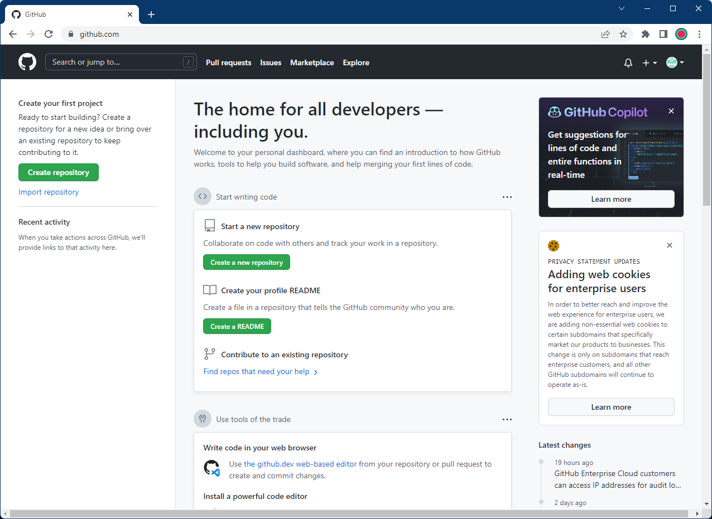

# GitHub

- [Introduction](#introduction)
- [Setup](#setup)
  - [Create An Account](#create-an-account)

## Introduction

GitHub is the place where all of your `git` repositories will be stored online

Here's what you need to know:

- FREE
  - A pro subscription is **free** [if you are enrolled in university](https://education.github.com/students)
- Portability
  - Your work can be accessed anywhere
  - Collaboration is easy
- Sharing
  - Show off your work!
- The Standard
  - Share your GitHub with your employer

## Setup

### Create An Account

Let's begin by signing up.

1. Go to [github.com](https://github.com/).

   

2. Click the _sign up_ button, then enter an email and password.

   

   Don't worry: you can change the email, password, and username later if you don't like them.

   Follow along with the GitHub account setup but don't worry too much about what you fill out.

3. You're done!

   

   This is the screen you should be greeted with.
