# GitHub

- [Introduction](#introduction)
- [Setup](#setup)
  - [Create An Account](#create-an-account)
  - [Connect Your Computer](#connect-your-computer)
- [GitHub in Action](#github-in-action)
  - [Creating Repos on GitHub](#creating-repos-on-github)
  - [Cloning Repos](#cloning-repos)
  - [Pushing Changes](#pushing-changes)
    - [Existing Repos](#existing-repos)
    - [Cloned Repos](#cloned-repos)
  - [Pulling Changes](#pulling-changes)
  - [VSCode Version Control](#vscode-version-control)
- [Footnotes](#footnotes)

## Introduction

GitHub is the place where all of your `git` repositories will be stored online

Here's what you need to know:

- FREE
  - A pro subscription is **free** [if you are enrolled in university](https://education.github.com/students)
- Portability
  - Your work can be accessed anywhere
  - Collaboration is easy
- Sharing
  - Show off your work!
- The Standard
  - Share your GitHub with your employer

## Setup

### Create An Account

Let's begin by signing up.

1. Go to [github.com](https://github.com/).

   

2. Click the _sign up_ button, then enter an email and password.

   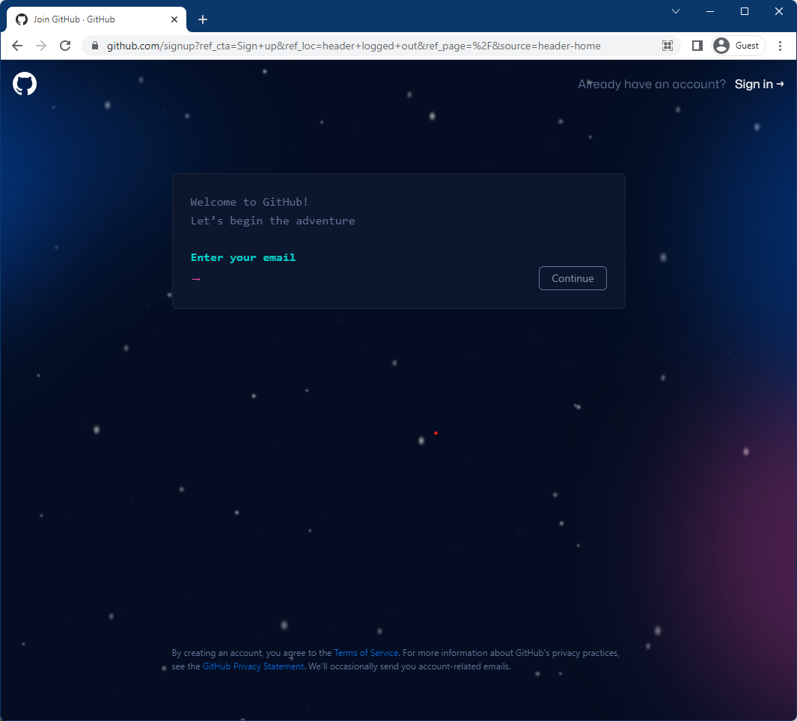

   Don't worry: you can change the email, password, and username later if you don't like them.

   Follow along with the GitHub account setup but don't worry too much about what you fill out.

3. You're done!

   

   This is the screen you should be greeted with.

### Connect Your Computer

GitHub needs to know that your computer is authorized to access information from your account.

One way to authorize a computer is via [ssh](https://www.geeksforgeeks.org/introduction-to-sshsecure-shell-keys/), which is a network protocol to transfer encrypted data.

Here is the rundown:

- You can access servers or other computers via the command line
- However, you need authorization via an SSH key, which is a fancy way of saying password
- Don't worry too much about how this works, unless you want to get into cybersecurity

1. Generate an SSH key

   ```bash
   # Generate SSH key on local computer
   # Remember to replace <youremail> (no carets)
   ssh-keygen -t ed25519 -C <youremail>
   ```
  
   When prompted by the console, accept all of the default options by clicking enter. Don't worry about setting a password or anything.

   Here is an example run.

   ```console
   09:44:04 sua@JustinPC:$ ~ → ssh-keygen -t ed25519 -C justinhoang@mines.edu
   Generating public/private ed25519 key pair.
   Enter file in which to save the key (/home/sua/.ssh/id_ed25519):
   Enter passphrase (empty for no passphrase):
   Enter same passphrase again:
   Your identification has been saved in /home/sua/.ssh/id_ed25519
   Your public key has been saved in /home/sua/.ssh/id_ed25519.pub
   The key fingerprint is:
   SHA256:CLjzYvagE+JMffpPrJ7tmt2maQdOpfxxHRjvOoFOQxk justinhoang@mines.edu
   The key's randomart image is:
   +--[ED25519 256]--+
   |                 |
   |   .     E .     |
   |  . .     o +    |
   |   . . . + . o   |
   |  +   o S . o .  |
   |o. + ..= = o o   |
   |=.= + oo= + o    |
   |.* =  Boo= o     |
   |..  +B=B+.  .    |
   +----[SHA256]-----+
   ```

2. Add the SSH key to GitHub

   ```bash
   # GitHub -> Settings -> SSH and GPG keys -> New SSH Key
   # Copy and paste this
   cat ~/.ssh/id_ed25519.pub
   ```

   Here is a sample output.

   ```console
   09:47:49 sua@JustinPC:$ ~ → cat ~/.ssh/id_ed25519.pub
   ssh-ed25519 AAAAC3NzaC1lZDI1NTE5AAAAIMpAZTJcElo8GzQlEpTbqenBdPoTcs3p79bVQCTXTwQW justinhoang@mines.edu
   ```

   Go to your GitHub settings, then click on the SSH and GPG Keys section.

   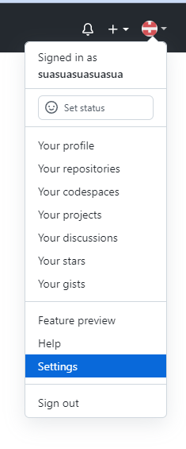

   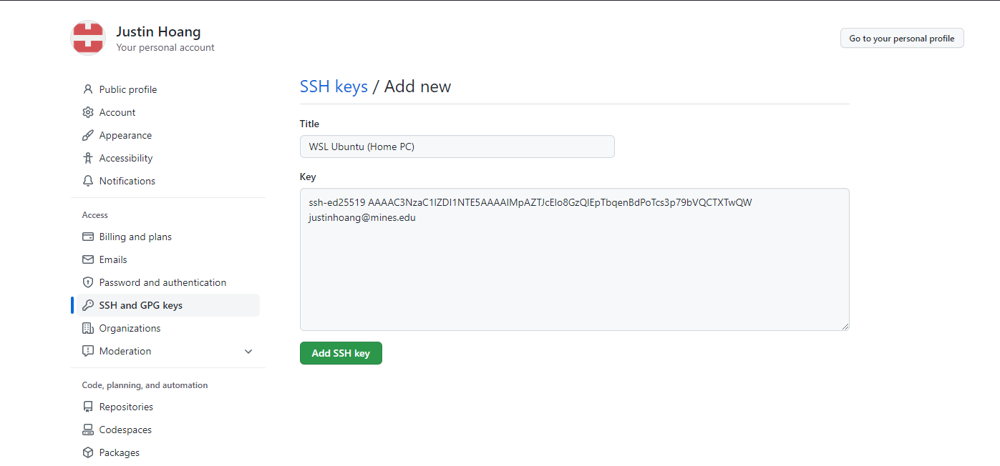

   Give your key a good title, then copy and paste the output into the field.

3. Verify that the key is connected

```bash
# Connects to the GitHub servers via SSH
ssh git@github.com
```

When prompted, say yes to continue connecting.

```console
sua@JustinPC:$ ~ → ssh git@github.com
The authenticity of host 'github.com (140.82.113.4)' can't be established.
ECDSA key fingerprint is SHA256:p2QAMXNIC1TJYWeIOttrVc98/R1BUFWu3/LiyKgUfQM.
Are you sure you want to continue connecting (yes/no/[fingerprint])? yes
Warning: Permanently added 'github.com,140.82.113.4' (ECDSA) to the list of known hosts.
PTY allocation request failed on channel 0
Hi suasuasuasuasua! You've successfully authenticated, but GitHub does not provide shell access.
Connection to github.com closed.
```

This is the line that you should look out for "_Hi suasuasuasuasua!_", where suasuasuasuasua should be your own username.

This is the final check that your computer is registered and authorized to access your account on GitHub.

Here are the new privileges:

- You are now allowed to clone, push, and pull from your own public and private repositories
  - GitHub requires authorization when cloning private repos
  - For public and private repos, you need authorization to push and pull, either from a username/password or SSH verification
- You will never be prompted your a password again, unless you delete the key or work on a new computer.[^1]

## GitHub in Action

### Creating Repos on GitHub

1. Go to [GitHub](github.com).
2. Click _new_ repo on the top left.

   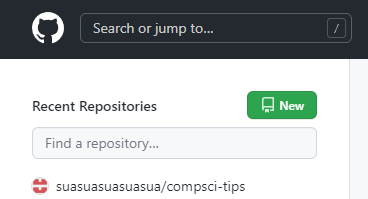

3. Fill out the page

   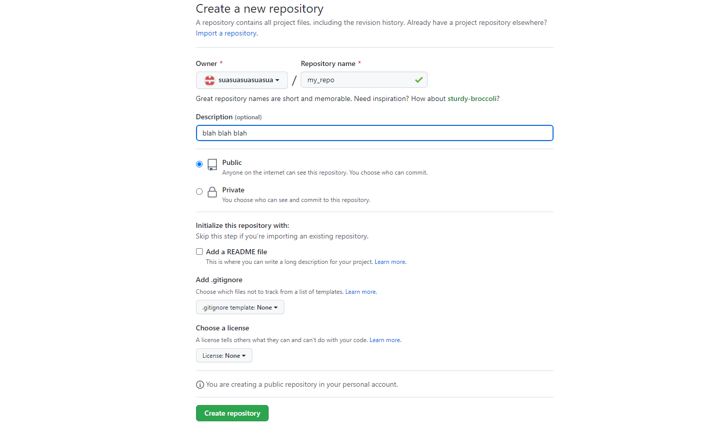
   - Make it public or private (be smart)
   - Click create repository

This is the final screen you'll be greeted with.

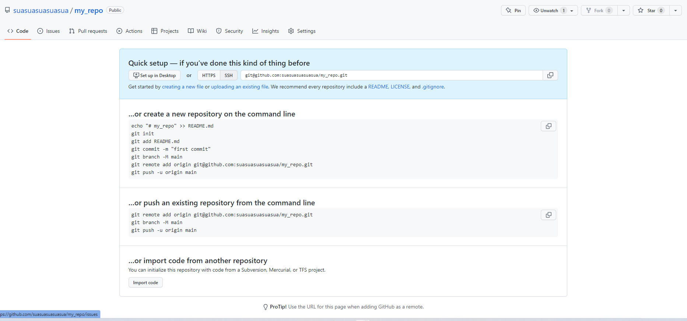

Don't worry, we'll fill this out soon.

### Cloning Repos

To clone a repo from GitHub, click the green code button and copy the link.

Make sure to grab the SSH link to the repo.

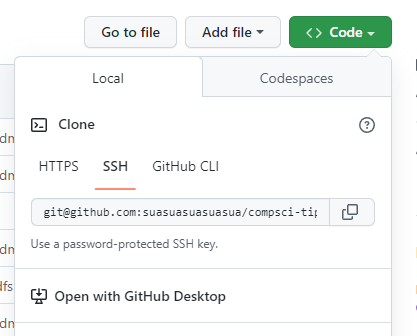

Open your terminal, then run the following.

```bash
# Get the SSH link from Github (NOT THE HTTP ONE)
git clone git@github.com:<username>/<repo-name>.git
```

Here's an example run of cloning this repo.

```console
sua@JustinPC:$ ~ → git clone git@github.com:suasuasuasuasua/compsci-tips.git
Cloning into 'compsci-tips'...
remote: Enumerating objects: 454, done.
remote: Counting objects: 100% (161/161), done.
remote: Compressing objects: 100% (131/131), done.
remote: Total 454 (delta 44), reused 77 (delta 21), pack-reused 293
Receiving objects: 100% (454/454), 3.17 MiB | 3.67 MiB/s, done.
Resolving deltas: 100% (171/171), done.
sua@JustinPC:$ ~ → ls
Documents  compsci-tips
                 |___________ Here's the repo!
```

### Pushing Changes

From here, I'll assume that you've created the same repo from [the previous section](#creating-repos-on-github)

#### Existing Repos

Copy the SSH link from the empty repo.

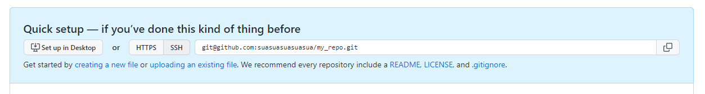

```bash
# Connect local repo to the remote repository on GitHub
# Grab this link from GitHub Repo > SSH > link
git remote add origin git@github.com:<username>/<repo-name>.git

# Set upstream branch so that we can push LOCAL changes to REMOTE repository
# Make sure you set the default branch to main, as specified in the git/ section
# >>> git config --global init.defaultBranch main 
git push -u origin main
```

Here is an example run of me creating a local repo, then connecting it to GitHub.

```console
sua@JustinPC:$ ~ → mkdir my_repo
mkdir: created directory 'my_repo'
sua@JustinPC:$ ~ → cd my_repo/
/home/sua/my_repo
sua@JustinPC:$ my_repo → git init
Initialized empty Git repository in /home/sua/my_repo/.git/
sua@JustinPC:$ my_repo touch README.md
sua@JustinPC:$ my_repo → git add README.md 
sua@JustinPC:$ my_repo → git commit -m "Initial Commit"
[main (root-commit) bb22b1b] Initial Commit
 1 file changed, 0 insertions(+), 0 deletions(-)
 create mode 100644 README.md
sua@JustinPC:$ my_repo → git remote add origin git@github.com:suasuasuasuasua/my_repo.git
sua@JustinPC:$ my_repo → git push -u origin main
Enumerating objects: 3, done.
Counting objects: 100% (3/3), done.
Writing objects: 100% (3/3), 218 bytes | 218.00 KiB/s, done.
Total 3 (delta 0), reused 0 (delta 0), pack-reused 0
To github.com:suasuasuasuasua/my_repo.git
 * [new branch]      main -> main
branch 'main' set up to track 'origin/main'.
```

#### Cloned Repos

If you clone the repo from GitHub, then you can avoid the hassle of [existing repos](#existing-repos).

You can copy the SSH link from GitHub and clone directly.

```console
sua@JustinPC:$ ~ → git clone git@github.com:suasuasuasuasua/my_repo.git
Cloning into 'my_repo'...
remote: Enumerating objects: 4, done.
remote: Counting objects: 100% (4/4), done.
remote: Compressing objects: 100% (2/2), done.
remote: Total 4 (delta 1), reused 3 (delta 0), pack-reused 0
Receiving objects: 100% (4/4), done.
Resolving deltas: 100% (1/1), done.
```

The remote upstream will be set automatically, and you won't need to create the directory.

### Pulling Changes

To keep your local repo up to date with the remote repo on GitHub, you can pull the changes.

Note that there could be merge conflicts that arise between the local and remote.

```bash
# Pull the changes
git pull
```

Here is an example of pulling new changes.

```console
11:08:32 sua@JustinPC:$ my_repo → git pull
remote: Enumerating objects: 5, done.
remote: Counting objects: 100% (5/5), done.
Unpacking objects: 100% (3/3), 636 bytes | 636.00 KiB/s, done.
remote: Total 3 (delta 0), reused 0 (delta 0), pack-reused 0
From github.com:suasuasuasuasua/my_repo
   d73283e..c46d35f  main       -> origin/main
Updating d73283e..c46d35f
Fast-forward
 README.md | 1 +
 1 file changed, 1 insertion(+)
```

### VSCode Version Control

VSCode can track the changes more easily for you.

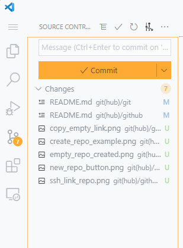

Located on the side bar, the branching icon is called **Version Control**.

Here are the advantages:

- Easily see which files have been added, changed, or deleted.
- Click on files to see _HOW_ the changes
- Select specific files to stage, then commit

You can use VSCode's command pallette (Ctrl+Shift+P or CMD+Shift+P) to work with `git` easily **and** avoid the command line.

For example:

- 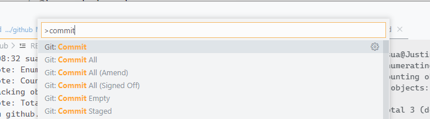
- 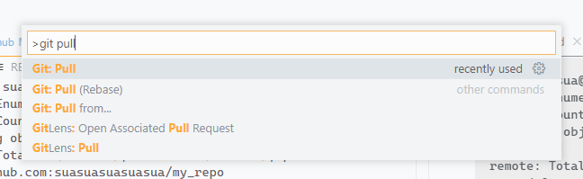

Realistically, you're probably going to use a tool like VScode's builtin VCS or [Github Desktop](https://desktop.github.com/).

---

## Footnotes

[^1]: Note that [even passwords](https://www.geekersdigest.com/github-deprecation-notice-switching-from-password-to-token-authentication/) haven't been allowed since last year.
